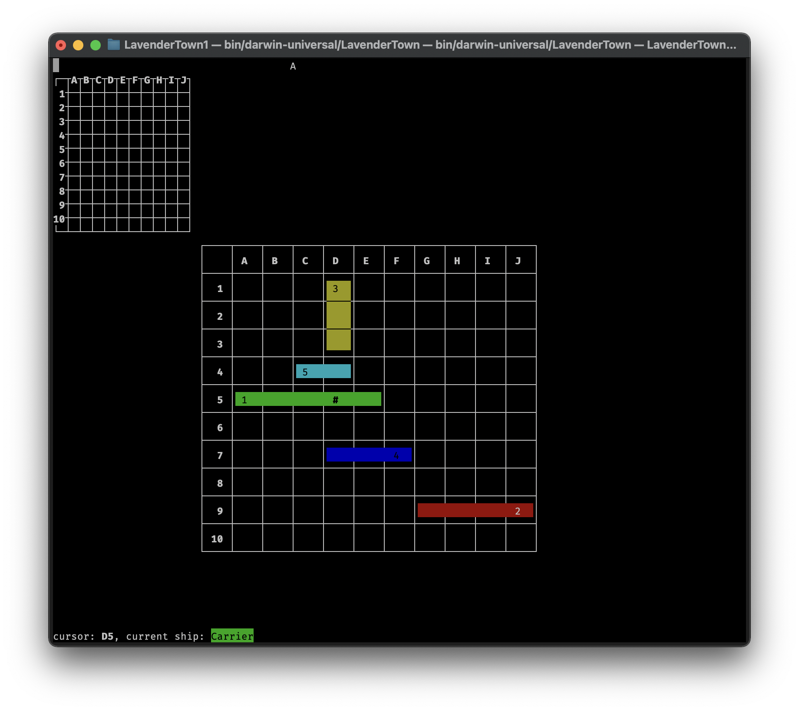

<h1 align="center">
    
    <br/>
    <a href="LICENSE">
        
    </a>
    <a href="https://github.com/marketplace/actions/super-linter">
    
    </a>
    <br/>
    Lavender Town
</h1>
<p align="center">
    A battleship game.
</p>

## Building

### MacOS

`ncurses` is installed by default. You only have to manually install `cmake`.\
You can either download CMake [directly](https://cmake.org/download/)
or you can use a package manager like [Homebrew](https://brew.sh):

```sh
brew install cmake
```

Then you can continue with [Building with CMake](#building-with-cmake)

### Linux

Make sure you have `cmake` and `ncurses` installed.

- How to install [CMake](https://cmake.org/install/)
- How to install [ncurses](https://www.cyberciti.biz/faq/linux-install-ncurses-library-headers-on-debian-ubuntu-centos-fedora/)

Then you can continue with [Building with CMake](#building-with-cmake)

### Windows

Windows is not Unix-based. Therefore `ncurses` is not available.
To circumvent this, you can use [MSYS2](https://www.msys2.org).\
Download and run the Installer from the website and then
run the `MSYS2 MSYS` Shortcut from the Start Menu.\
Inside this terminal, run the following commands:

1. Update the package database and base packages.

    ```sh
    pacman -Syu
    ```

2. Install `base-devel`, `gcc`, `cmake`, `ncurses` and `ncurses-devel`

    ```sh
    pacman -S base-devel gcc cmake ncurses ncurses-devel
    ```

Inside this Terminal, you can continue with [Building with CMake](#building-with-cmake)

### Building with CMake

Make sure that you are in the root of this Repository.
(Where this `README.md` resides)

1. create a clean build directory

    ```sh
    rm -rf build && mkdir build
    ```

2. cd into the build directory

    ```sh
    cd build
    ```

3. Configure the project using CMake

    ```sh
    cmake ..
    ```

4. Build the project

    ```sh
    cmake --build .
    ```

After building, the binary named `LavenderTown`
(`LavenderTown.exe` on Windows) is located under `build/bin`.

## Roles

[`Product Owner` (Kilian Schlosser)](https://github.com/Firnin)

[`Scrum Master` (Christian Shögin)](https://github.com/ChristianSchoegin)

[`Developer` (Anton Pieper)](https://github.com/AntonPieper)

[`Developer` (Azat Erol)](https://github.com/4zatero7)

~~[`Developer` (Kemal Bibinoglu)](https://github.com/Kemaleb98)~~
